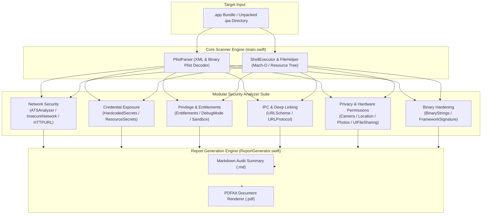

<div align="center">

# ios-security-scanner — Automated iOS Static Application Security Testing (SAST) Toolkit

[](https://developer.apple.com/swift/)
[](https://developer.apple.com/macos/)
[](https://mas.owasp.org/)
[-critical?style=for-the-badge&logo=target&logoColor=white)](https://csrc.nist.gov/)
[](https://developer.apple.com/documentation/pdfkit)
[](LICENSE)

<p align="center">
  A high-throughput Swift CLI security auditing engine that inspects compiled iOS application bundles (<code>.app</code> / <code>.ipa</code>) for cryptographic misconfigurations, credential leaks, App Transport Security bypasses, entitlements flaws, and OWASP MASVS violations.
</p>

</div>

---

## Table of Contents
- [Overview](#overview)
- [Architecture & Audit Pipeline](#architecture--audit-pipeline)
- [Security Analyzer Suite](#security-analyzer-suite)
- [OWASP MASVS Alignment](#owasp-masvs-alignment)
- [CLI Usage & Output Formats](#cli-usage--output-formats)
- [Tech Stack](#tech-stack)
- [Project Structure](#project-structure)
- [Getting Started](#getting-started)
- [Author & License](#author--license)

---

## Overview

**ios-security-scanner** is an automated static code and binary analysis tool engineered in Swift for security engineers, penetration testers, and iOS developers. The utility executes non-invasive static audits against compiled iOS application bundles, unpacking property lists, Mach-O binary symbol tables, entitlements, and resource trees to detect security flaws prior to App Store submission or enterprise deployment.

### Core Objectives
- **Automated Pre-Flight Security Audits:** Integrate into continuous delivery pipelines to fail builds containing high-severity vulnerabilities.
- **Deep Bundle Inspection:** Dissect `Info.plist`, embedded entitlements, URL schemes, third-party framework code signatures, and Mach-O strings.
- **Multi-Format Executive Reporting:** Compile structured findings into Markdown and presentation-ready PDF vulnerability reports.

---

## Architecture & Audit Pipeline



---

## Security Analyzer Suite

The scanner incorporates specialized inspection modules targeting distinct vulnerability vectors:

| Analyzer Module | Target Area | Security Risk Identified |
| :--- | :--- | :--- |
| **`ATSArbitraryLoadsAnalyzer`** | Network Security | Global `NSAllowsArbitraryLoads` flag permitting unencrypted cleartext HTTP traffic. |
| **`ATSExceptionAnalyzer`** | Network Security | Overly permissive domain exception rules bypassing TLS constraints. |
| **`HardcodedSecretsAnalyzer`** | Secret Detection | Regex pattern matching for API keys, AWS credentials, Bearer tokens, and private keys across resources. |
| **`DebugModeAnalyzer`** | Runtime Hardening | `get-task-allow` entitlement enabled in release binaries allowing runtime debugging/injection. |
| **`EntitlementsAnalyzer`** | Sandboxing | Insecure Keychain access group sharing, push notification misconfigurations, or elevated sandbox privileges. |
| **`URLSchemeAnalyzer`** | Inter-Process Comm | Custom deep-link scheme registration without origin validation, exposing the app to scheme hijacking. |
| **`UIFileSharingAnalyzer`** | Data Protection | `UIFileSharingEnabled` or `LSSupportsOpeningDocumentsInPlace` exposing the sandbox directory to external file systems. |
| **`PrivacyPermissionsAnalyzer`** | Privacy & Compliance | Missing or boilerplate privacy usage strings (`NSCameraUsageDescription`, `NSLocationUsageDescription`). |
| **`BinaryStringsAnalyzer`** | Binary Analysis | Detection of insecure C library invocations (`strcpy`, `sprintf`, `gets`) and unstripped symbol strings. |
| **`FrameworkSignatureAnalyzer`**| Dependency Supply Chain | Verification of code signatures on embedded third-party `.framework` and `.dylib` components. |

---

## OWASP MASVS Alignment

The tool maps directly to verification categories defined in the **OWASP Mobile Application Security Verification Standard (MASVS)**:

- **MASVS-NETWORK:** Validates TLS requirements and flags all ATS circumventions (MASVS-NETWORK-1, MASVS-NETWORK-2).
- **MASVS-STORAGE:** Detects insecure file sharing flags that allow unauthorized file read access (MASVS-STORAGE-1).
- **MASVS-AUTH:** Identifies hardcoded authentication tokens and client secrets (MASVS-AUTH-1).
- **MASVS-PLATFORM:** Audits IPC URL schemes, custom permissions, and app sandbox boundaries (MASVS-PLATFORM-1, MASVS-PLATFORM-2).
- **MASVS-RESILIENCE:** Checks for release compilation flags and absence of active debugging symbols (MASVS-RESILIENCE-1).

---

## CLI Usage & Output Formats

### Execution Syntax
```bash
# Scan a compiled .app bundle
swift run ios-security-scanner /path/to/Payload/TargetApp.app

# Scan an unpacked IPA directory
ios-security-scanner /path/to/ExtractedIPA/Payload/TargetApp.app
```

### Sample Terminal Output
```
Starting scan for: /Users/audit/Builds/TargetApp.app
Info.plist parsed successfully
1. ATS Check Result: [FAIL] NSAllowsArbitraryLoads is set to TRUE (Global Cleartext Enabled)
2. Debug Mode Check Result: [PASS] get-task-allow is disabled
3. URL Scheme Check Result: [WARN] Registered scheme 'targetapp://' lacks input validation guard
4. Hardcoded Secrets Check Result: [FAIL] 2 potential API keys detected in Assets.car
5. File Sharing Check Result: [PASS] UIFileSharingEnabled is disabled

Scan completed. Reports generated:
- Reports/scan-report_TargetApp.app_2026-08-25_16-40.md
- Reports/scan-report_TargetApp.app_2026-08-25_16-40.pdf
```

---

## Tech Stack

- **Language:** Swift 5.9+ (Native macOS Command-Line Executable)
- **Frameworks:** Foundation, CoreServices, PDFKit
- **Parsing:** PropertyListSerialization (XML & Binary Plist Formats)
- **System Utilities:** Mach-O string parsing, regex pattern matching
- **Output:** GitHub-Flavored Markdown, Apple PDFKit Document Generation

---

## Project Structure

```
ios-security-scanner/
├── main.swift                       # CLI Entry Point & Scan Orchestrator
├── Parsers/
│   └── PlistParser.swift            # Binary & XML PropertyList Decoder
├── Analyzers/                       # Modular Security Rule Checks
│   ├── ATSAnalyzer.swift            # App Transport Security Suite
│   ├── ATSArbitraryLoadsAnalyzer.swift
│   ├── ATSExceptionAnalyzer.swift
│   ├── HardcodedSecretsAnalyzer.swift # Regex Credential Scanner
│   ├── ResourceSecretsAnalyzer.swift
│   ├── DebugModeAnalyzer.swift      # get-task-allow Verification
│   ├── EntitlementsAnalyzer.swift   # Sandbox Entitlements Audit
│   ├── URLSchemeAnalyzer.swift      # Custom URL Scheme Inspector
│   ├── UIFileSharingAnalyzer.swift  # Sandbox File Sharing Check
│   ├── PrivacyPermissionsAnalyzer.swift # Info.plist Permission Strings
│   ├── CameraMicrophoneUsageAnalyzer.swift
│   ├── LocationUsageAnalyzer.swift
│   ├── PhotoLibraryUsageAnalyzer.swift
│   ├── BinaryStringsAnalyzer.swift  # Mach-O Symbol & API Inspector
│   ├── FrameworkSignatureAnalyzer.swift # Framework Codesign Audit
│   ├── ThirdPartySDKAnalyzer.swift  # Dependency Analyzer
│   └── InsecureNetworkAnalyzer.swift
├── Report/
│   └── ReportGenerator.swift        # Markdown & PDFKit Report Compiler
├── Utils/
│   ├── FileHelper.swift             # Recursive File System Enumerator
│   └── ShellExecutor.swift          # Subprocess Command Runner
└── Reports/                         # Generated Vulnerability Audit Reports
```

---

## Getting Started

### Prerequisites
- macOS Ventura (13.0+) or macOS Sonoma (14.0+) / macOS Sequoia (15.0+)
- Xcode 15.0+ or Command Line Tools for Xcode

### Build from Source

1. **Clone the repository:**
   ```bash
   git clone https://github.com/a360n/ios-security-scanner.git
   cd ios-security-scanner
   ```

2. **Build the CLI executable:**
   ```bash
   xcodebuild -project ios-security-scanner.xcodeproj -scheme ios-security-scanner -configuration Release build
   ```

3. **Run a security scan:**
   ```bash
   ./build/Release/ios-security-scanner /path/to/YourApp.app
   ```

---

## Author

**Ali Nasser (Ali Al-Khazali)**
- Portfolio: [www.ali-nasser.dev](https://www.ali-nasser.dev)
- GitHub: [@a360n](https://github.com/a360n)
- LinkedIn: [Ali Nasser](https://www.linkedin.com/in/ali-nasser-dev/)

---

## License

This project is licensed under the MIT License — see the [LICENSE](LICENSE) file for details.
